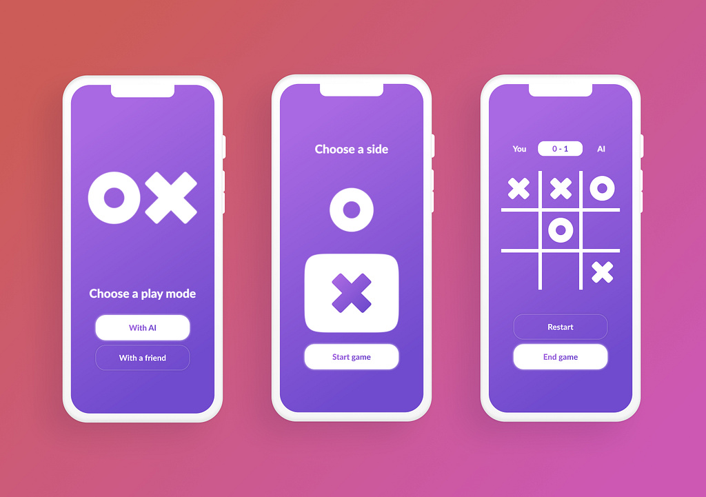

# Tic Tac Toe

The classic game of Tic Tac Toe. Know with AI competitor.

## Inspiration

This project was inspired by a dribble tic tac toe app design by [wojciechmarek](https://dribbble.com/wojciechmarek).



## Installation

Get gemini API key [here](https://ai.google.dev/gemini-api/docs/api-key).

Install from the release [v1.0.0]().

Build from source code.
- Clone the repo

```sh
git clone https://github.com/DagmawiIsaiah/tic-tac-toe.git
```
- And then you can use the normal build & run procedure 
```sh
flutter pub get
flutter run
```
